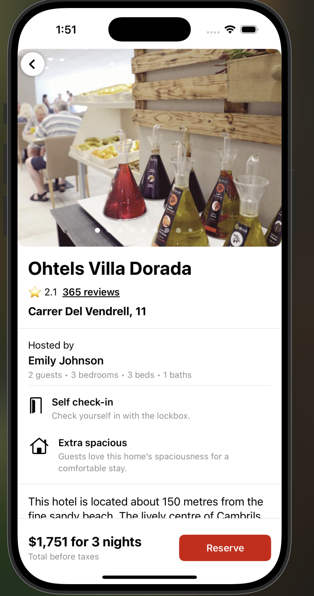

# Stayzy - Hotel Booking App

Stayzy is a modern iOS application that helps users find and book hotels with ease. Built with SwiftUI and following MVVM architecture, it offers a seamless and intuitive user experience for hotel bookings.

## 🌟 Features

- **User Authentication**
  - Sign In with Email/Password
  - Sign Up with Email/Password
  - Social Media Login (Google, Facebook, Apple)
  - Secure authentication flow
  - Password recovery
  - Session management

- **Hotel Search & Booking**
  - Advanced hotel search with filters
  - Detailed hotel information
  - Real-time availability checking
  - Secure booking process
  - Price comparison
  - Location-based search
  - Map integration
  - Hotel reviews and ratings

- **User Profile Management**
  - Personal information management
  - Booking history
  - Saved preferences
  - Wishlist functionality
  - Profile customization
  - Notification settings
  - Payment methods management

- **Trip Management**
  - View upcoming trips
  - Trip details and itinerary
  - Booking modifications
  - Trip sharing
  - Trip reminders
  - Digital boarding pass
  - Trip cancellation

## 🛠 Technical Stack

### Core Technologies
- **Framework**: SwiftUI
- **Language**: Swift 5.5+
- **Architecture**: MVVM (Model-View-ViewModel)
- **iOS Target**: iOS 15.0+

### Backend & Data
- **Authentication**: Firebase Auth
  - Email/Password authentication
  - Social media sign-in (Google, Facebook, Apple)
  - Secure session management
- **Database**: 
  - CoreData for local storage
  - Firebase Firestore for cloud data
- **File Storage**: Firebase Storage
- **Analytics**: Firebase Analytics

### UI/UX
- **UI Framework**: SwiftUI
- **Custom Components**: 
  - Custom search bar
  - Rating components
  - Hotel cards
  - Booking forms
- **Design System**:
  - Custom color scheme
  - Typography system
  - Component library

### Networking
- **API Layer**: Custom implementation
  - RESTful API integration
  - JSON parsing
  - Error handling
  - Request/Response caching
- **Maps Integration**: Google Maps SDK
- **Image Loading**: Async image loading with caching

### Development Tools
- **Version Control**: Git
- **Dependency Management**: Swift Package Manager
- **Testing**:
  - XCTest for unit testing
  - SwiftUI Preview for UI testing
  - UI tests for critical flows
- **Code Quality**:
  - SwiftLint for code style
  - SwiftFormat for formatting
  - Code coverage tracking

### Performance & Optimization
- **Caching**: 
  - CoreData for local data
  - Image caching
  - API response caching
- **Memory Management**: ARC
- **Background Processing**: Background tasks and fetch

### Security
- **Authentication**: Firebase Auth
- **Data Encryption**: 
  - Secure storage for sensitive data
  - HTTPS for network calls
- **Input Validation**: Custom validation rules

## 📱 Screenshots

### Authentication Flow
<table style="border: none;">
<tr>
<td style="border: none;">

<p align="center">Welcome Screen</p>
<p align="center">App introduction and login options</p>
</td>
<td style="border: none;">

<p align="center">Sign In Screen</p>
<p align="center">Email/Password login with social options</p>
</td>
</tr>
<tr>
<td style="border: none;">

<p align="center">Sign Up Screen</p>
<p align="center">New user registration with validation</p>
</td>
<td style="border: none;">

<p align="center">Profile Information</p>
<p align="center">Edit personal details</p>
</td>
</tr>
</table>

### Main Features
<table style="border: none;">
<tr>
<td style="border: none;">

<p align="center">Explore Screen</p>
<p align="center">Browse hotels with filters and search</p>
</td>
<td style="border: none;">

<p align="center">Hotel Details</p>
<p align="center">Comprehensive hotel information</p>
</td>
<td style="border: none;">

<p align="center">Hotel Description</p>
<p align="center">Detailed amenities and facilities</p>
</td>
</tr>
</table>

### Maps & Location
<table style="border: none;">
<tr>
<td style="border: none;">

<p align="center">Map View</p>
<p align="center">Interactive hotel location map</p>
</td>
<td style="border: none;">

<p align="center">Full Map View</p>
<p align="center">Expanded map with all nearby hotels</p>
</td>
</tr>
</table>

### User Profile & Trips
<table style="border: none;">
<tr>
<td style="border: none;">

<p align="center">Profile Screen</p>
<p align="center">User profile and settings</p>
</td>
<td style="border: none;">

<p align="center">Trips Screen</p>
<p align="center">View and manage bookings</p>
</td>
</tr>
<tr>
<td style="border: none;">

<p align="center">Wishlists</p>
<p align="center">Saved hotels and favorites</p>
</td>
<td style="border: none;">

<p align="center">Messages</p>
<p align="center">Booking notifications and support</p>
</td>
</tr>
</table>

## 🔧 Installation

1. Clone the repository
```bash
git clone https://github.com/yourusername/Stayzy.git
```

2. Open the project in Xcode
```bash
cd Stayzy
open Stayzy.xcodeproj
```

3. Install dependencies
```bash
# Using Swift Package Manager
# Dependencies are automatically managed by Xcode
```

4. Set up Firebase
   - Add your `GoogleService-Info.plist` to the project
   - Configure Firebase in your project settings
   - Enable required Firebase services (Auth, Firestore, etc.)

5. Configure CoreData
   - Ensure `LocalStorage.xcdatamodeld` is properly set up
   - Run initial migration if needed

6. Build and run the project

## 📋 Requirements

- iOS 15.0+
- Xcode 13.0+
- Swift 5.5+
- Firebase account
- Google Maps API key (for map features)
- CoreData setup

## 🏗 Project Structure

```
Stayzy/
├── App/
│   └── App configuration and setup
├── Views/
│   ├── Authentication/
│   │   ├── SignInView
│   │   ├── SignUpView
│   │   └── FirstScreenView
│   ├── Profile/
│   │   ├── ProfileView
│   │   └── ProfileInfoView
│   ├── Trips/
│   │   └── TripsView
│   └── Components/
│       ├── SearchBar
│       └── WishlistHeartButton
├── ViewModel/
│   └── Business logic and state management
├── Models/
│   └── Data models and entities
├── Network/
│   └── API communication layer
├── CoreData/
│   └── Local database configuration
├── Repository/
│   └── Data access layer
├── Utils/
│   └── Helper functions and extensions
└── Resources/
    └── Assets and configuration files
```

## 🧪 Testing

The project includes comprehensive unit tests and UI tests:

```bash
# Run unit tests
xcodebuild test -scheme Stayzy -destination 'platform=iOS Simulator,name=iPhone 14'

# Run UI tests
xcodebuild test -scheme Stayzy -destination 'platform=iOS Simulator,name=iPhone 14' -only-testing:StayzyUITests
```

### Test Coverage
- Authentication flows
- Hotel search functionality
- Booking process
- User profile management
- Trip management
- UI components
- Network layer
- CoreData operations
- Repository layer
- ViewModel logic

